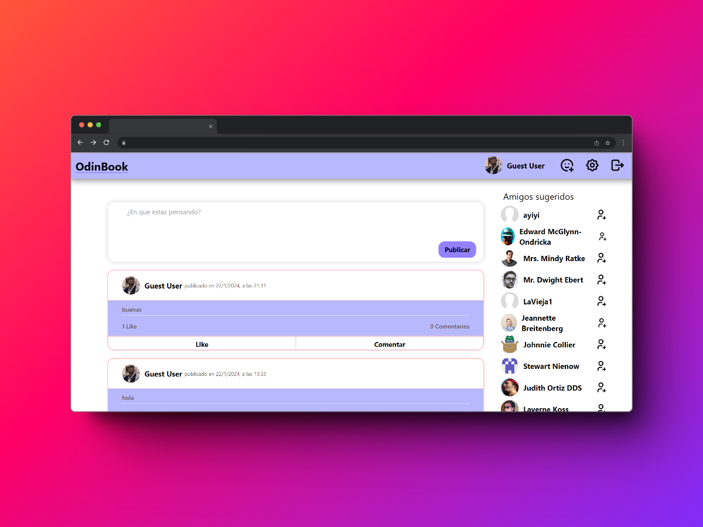
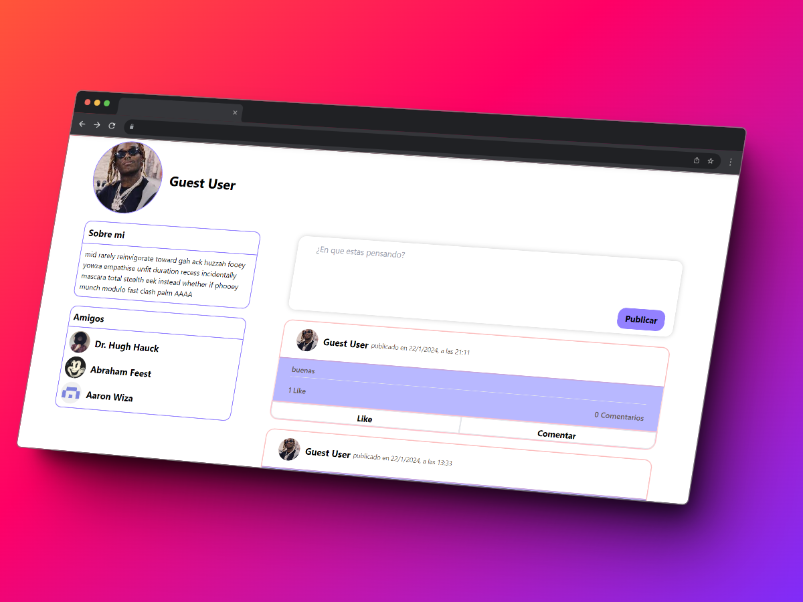
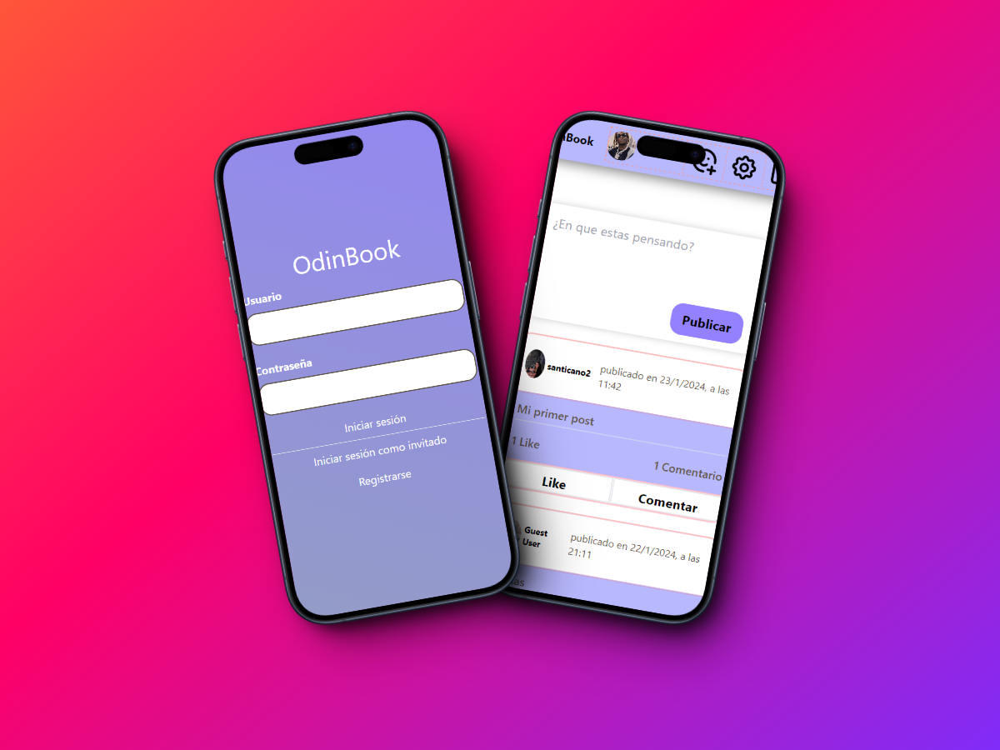

# OdinBook

Proyecto de The Odin Project, la idea era intentar hacer un clon de una red social, elegí Facebook.
Hecho con React, Tailwind, NodeJS, Express, MongoDB, Vite

[Visitar]()
[API](https://github.com/LaVieja1/TOP_OdinBook_BackEnd)

